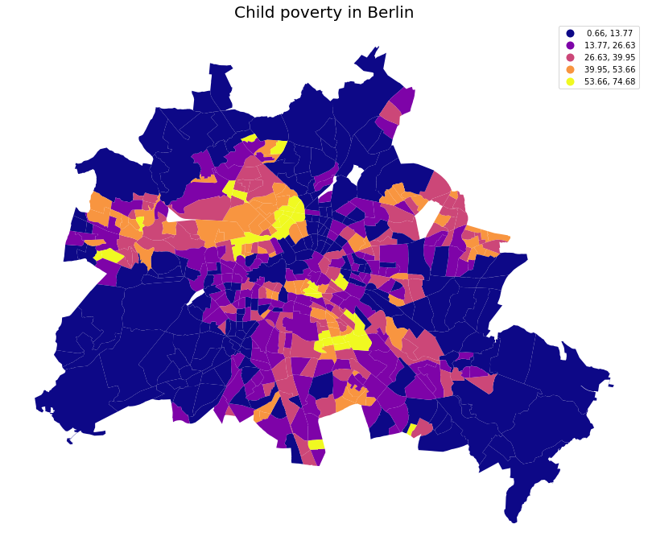
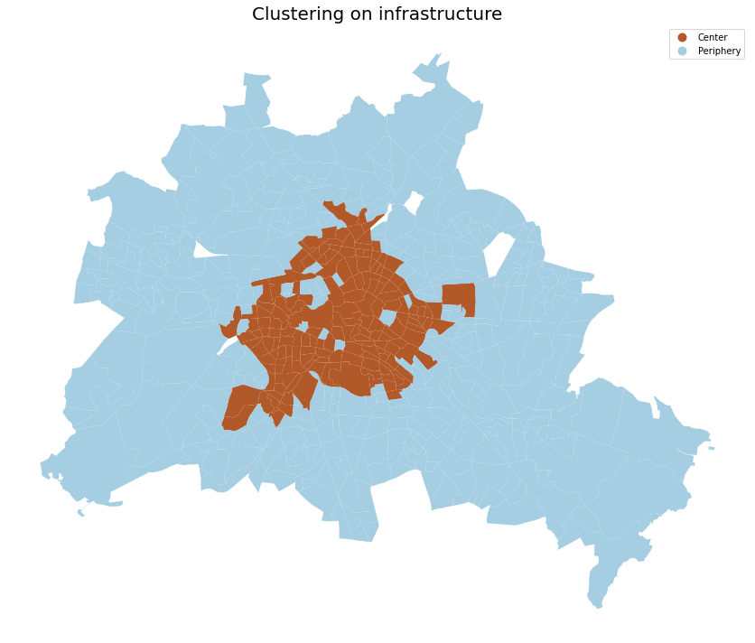

# Analizing child poverty in Berlin

Poverty is not only a material matter; it affects children’s everyday life, their social network, their educational chances, even their health. Together with social segregation, which limits childrens' exposure to other milieus, it can become a trap that is extremely hard to escape. 

Is child poverty clustered in Berlin? If so, how and why? 

Just looking at the spatial distribution (see Fig. 1 below) could answer our first question. Fortunately, we can verify this intuition with geostatistical tests, Moran's I test being the most fundamental one. They confirm our hypothesis: there is social segreation in Berlin and child poverty is clustered.

<b>Fig. 1 Distribution of child poverty in Berlin (natural breaks)</b>

## Data collection and processing

We collected more than 100 geodata features from <a href="https://www.openstreetmap.org/#map=5/51.330/10.453">OpenStreetMap<a>  and <a href="https://daten.berlin.de/">Berlin Open Data platform<a>, including data on demographics, housing, urban planning and migration. 

Working with <a href="https://geopandas.org/en/stable/">GeoPandas<a> and <a href="https://pysal.org/">Pysal<a>, we used spatial join and areal interpolation to aggregate our features to the level of the 542 Berliner Plannungsräume (planning areas), the smallest statistical areas on which social data is publicly available. Spatial vector data can have the form of a polygon, a line or a point. We transformed points data into polygons by applying a 500m buffer to them. This way, we made sure that the borders of the planning areas were smoother - having features situated close to another planning area impact it as well.

Our full dataset had 105 columns and 542 rows. 
We had to drop the 6 planning areas with the least residents because we did not have their child poverty rate and imputed other missing value with Sklearn KNN Imputer. 

<b>Fig. 2 Wordcloud displaying Pearson correlation with child poverty</b>

    
## Clustering 

We used K-means clustering to observe patterns in our data. We identified spatial patterns with regards to social data: planning areas with higher or lower Social Index (an index built by unemployement rate, child poverty and share of beneficiaries of social welfare) are not randomly distributed throughout space. They tend to form regions. 
We also observed a very clear infrastructural difference between center and periphery after using K-Means algorithm on 30 infrastrutural features. 
    

    <b>Fig. 3 Clustering on 24 infrastructural features*</b>

## Spatial regression

We decided to focus on the correlation between infrastructure and child poverty. In what context do children leave in poverty? Does child poverty correlate with infrastructural deficit? To answer these questions, we turned to regressions. 

- Target (dependent variable): Child poverty
- Features (independent / explanatory features): a selection of 10 infrastructural features (cultural institutions, schools and kindergartens, social housing, public housing, outdoor recreation facilities, parks and playgrounds, train stations, places for extracurricular education). 

* **Baseline: OLS Regression**
    - Our baseline model was a regular OLS regression (we used <a href = "https://pysal.org/spreg/generated/spreg.OLS.html"> Pysal spreg OLS model<a>)
    - With an R2 from 0.36, it gave us fairly good results: we were able to explain 36% of the variablity of child poverty based on our selection of 10 infrastructural features
    - However, white test for heteroskedasticity was very significant, meaning our residuals where not randomly distributed, which violates a central assumption of an OLS regression and meant the calculated coefficients could not trusted. 
    - Moran's I test on the regression's residuals was also significant, which meant residuals were spatially autocorrelated.
    
* **OLS Regression with regime**
    - We added space manually to our model thanks to a regime, allowing it to output different coefficients between East and West Berlin. 
    - This improved our model gave a slightly higher R2 for East Berlin (0.37 vs. 0,36 for West Berlin).
    - White test for both regimes were not significant anymore. 
    - According to spatial diagnostics (Moran'I and Lagrange Multriplier tests) however, there were still lag spatial effects, so we turned to **spatial regressions**. 
    
We conducted both error and lag models, with and without regimes. Considering some planning areas are very small and might be impacted by infrastructures of planning areas which don't share a border, we used inverse distance weights.

* **Error models**
    - In <a href = "https://pysal.org/spreg/generated/spreg.ML_Error.html#spreg.ML_Error"> error models<a>, spatial autocorrelation is considered as noise and added to the error term of the regression equation. 
    - Theoretically, this would imply that neighbouring observations are similar because they share the same characterics, and not because they influence each other. 
    - Error models did not perform much better than the OLS regression (Pseudo R2 of 0.38). 
    
* **Lag models**
    - In <a href = "https://pysal.org/spreg/generated/spreg.ML_Lag.html#spreg.ML_Lag"> lag models<a>, spatial autocorrelation is considered as a feature: the y values of neighbours is added to the regression equation. 
    - They theoretically imply that neighbouring observations are influencing each other.
    - By far, lag models outperformed all other models, which is in line with the fact that the social context is the biggest factor for child poverty. 
    - Adding regimes improved the performance of the model, which confirms that there are still significant infrastructural differences between East and West Berlin. 

<b>Fig. 4 Summary of the models performances</b>

    
Here is a comparison of the repartition and the value of our residuals between our baseline model and our best performing model. In red regions, the models underestimated child poverty. In blue regions, they overestimated it. 
    

<b>Fig. 5 Maps of the residuals of the OLS model and the ML Lag Model with an East West Regime </b>

Against the idea of infrastructural deserts, which are observed in other cities, e.g. in the US, we found that child poverty is not systematically correlated with a lack of cultural institutions, outdoor facilities or schools. Our model further identified two very significant features for child poverty: social housing and public housing. Here is an overview of the regression coefficients outputed by our model: 

<b>Fig. 5 Features significance of ML Lag Regimes model (z coefficients) </b>

This project was conducted by Maciej Szuba, Nichanok Auevechanichkul and Safia Ahmedou as part of a Data Science Bootcamp at Le Wagon (batch #874) in September 2022.

Have a look at our <a href="https://github.com/NichaNichanok/appyouthinthecity">webapp repository<a>!

 
* Features included: public transportation (all kinds), railway stations, resturants, sommunity services, health care / hospital / doctors, public services, places for extracurricular education, universities, urban furniture, parcs / playgrounds, water points, soial housing, public housing, share of buildings built until 1940, share of buildings built between 1941 and 1990, share of buildings built between 1991 and 2015, vegetation volume per sqm, Kindergartens, primary schools, Gymnasiums, other secundary schools, vocational schools, other types of schools, schools for children with special needs. 
    
